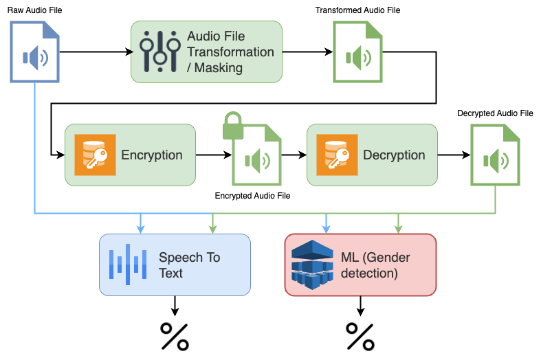

# Securing Smart Home Speakers: Designing A Security and Privacy System

__ELEC0138 22/23 Group 11 Project Code__

Smart home speakers have gained widespread popularity over the last few years and have become a common item in households. Due to their access to sensitive speech data, it is important to evaluate the threats prevalent in the smart speaker environment. This report aims to analyze threats such as third-party data access and data exposure and implements defense methodologies to evaluate their effectiveness against these threats without hindering the required functionality.

This project identifies security and privacy threats to the smart home speaker environment and evaluates the effectiveness of security measures taken to address these threats. The paper proposes a combination of audio transformation and end-to-end encryption to mitigate the threat of data exposure and third-party data access. This project demonstrates that it is possible to decrease the effectiveness of ML-based models used for data extraction by masking characteristics in the audio files. This process can greatly increase privacy, while only marginally affecting the performance of the speech-to-text models. We have also demonstrated that end-to-end encryption can be used on audio files with no loss of speech information while greatly increasing the security and privacy of audio files.  

## Running the Project Demo

As it is difficult to replicate the entire pipeline for the project with the provided code, we have provided a demo of the project which can be used to demonstrate the various processes used in the assignment.

* The project demo can be run from the [main.ipynb](./main.ipynb) file.
* This demo uses the raw audio files from the [raw](./demo/raw) folder. The other files in the [demo](./demo) folder (and the subfolders) can be deleted, as these will get produced during the project, as described in the project structure below.
* The trained machine learning model from [models](./models) is used during this demo.
* The outputs produced in the demo are already included in [main.ipynb](./main.ipynb) and [demo](./demo).
* The full run through of the demo is demonstrated in the [project video](https://liveuclac-my.sharepoint.com/:v:/r/personal/uceesoo_ucl_ac_uk/Documents/ELEC0138\%20Group\%2011\%20Assignment\%20Presentation.mp4?csf=1&web=1&e=jR4c1u).
* The figure above describes what this process looks like.

## Datasets

Due to the size of the datasets, they are not included in the repository. However, the datasets used in this project can be downloaded from the following locations.

* _Training Dataset_: Used for training the machine learning gender detection model.
    * Can be downloaded from https://github.com/x4nth055/gender-recognition-by-voice
* _Testing Dataset_: Used for evaluating the various sections of the code (i.e., audio transformation, encryption-decryption, speech-to-text, gender detection using the machine learning model).
    * Can be downloaded from TODO

## Project Structure

The project structure with descriptions for each file/directory have been provided below. It should be noted that various portions of the project were developed independently, and the processed files from relevant portions were shared after processing. Thus, there is not direct way to run the entire project pipeline.

* [.gitattributes](./.gitattributes) - Git attributes
* [.gitignore](./.gitignore) - Git ignore 
* [README.md](./README.md) - This file :)
* [avcodec-60.dll](./avcodec-60.dll) - TODO
* [avdevice-60.dll](./avdevice-60.dll) - TODO
* [avfilter-9.dll](./avfilter-9.dll) - TODO
* [avformat-60.dll](./avformat-60.dll) - TODO
* [avutil-58.dll](./avutil-58.dll) - TODO
* [constants.py](./constants.py) - Used to store constants used by the audio transformation code.
* [environment.yml](./environment.yml) - Used to create the conda environment which was used to run the audio transformation code.
* [ffmpeg.exe](./ffmpeg.exe) - TODO
* [ffplay.exe](./ffplay.exe) - TODO
* [ffprobe.exe](./ffprobe.exe) - TODO
* [main.ipynb](./main.ipynb) - Used to run the __demo__ for the project.
* [main.py](./main.py) - Used to run the audio transformation code. Calls the transformation function with the location for the dataset directory (not included in the repository).
* [postproc-57.dll](./postproc-57.dll) - TODO
* [swresample-4.dll](./swresample-4.dll) - TODO
* [swscale-7.dll](./swscale-7.dll) - TODO
* [MLP model](./MLP&#32model) - Contains the code for the machine learning gender detection model.
    * [Gender Classification_final.ipynb](./MLP&#32model/Gender&#32Classification_final.ipynb) - The final trained model with keras tuner, accuracy of gender dectection
    * [dataset.txt](./MLP&#32model/dataset.txt) - The training model dataset comes from https://github.com/x4nth055/gender-recognition-by-voice 
* [demo](./demo) - Folder used to store the files for the demo.
    * [processed_audio_result.csv](./demo/processed_audio_result.csv) - Speech-to-text results for the transformed audio files.  This can be safely deleted before running the demo.
    * [raw_audio_result.csv](./demo/raw_audio_result.csv) - Speech-to-text results for the raw audio files.  The files in this folder can be safely deleted before running the demo.
    * [text.txt](./demo/text.txt) - TODO
    * [raw](./demo/raw) - Contains the raw audio files for the demo. This should not be deleted when running the demo, as these files are used during the demo.
    * [transformed](./demo/transformed) - Contains the transformed audio files produced during the demo. The files in this folder folder can be safely deleted before running the demo.
    * [transformed_decrypted](./demo/transformed_decrypted) - Contains the decrypted files produced during the demo. The files in this folder folder can be safely deleted before running the demo.
    * [transformed_encrypted](./demo/transformed_encrypted) - Contains the encrypted files produced during the demo. The files in this folder folder can be safely deleted before running the demo.
* [figs](./figs) - Contains some figures used for this file.
* [keys](./keys) - Contains keys used for the encryption-decryption process.
    * [AES_key.enc](./keys/AES_key.enc) - Contains encrypted AES key
    * [AES_key.txt](./keys/AES_key.txt) - Contains generated AES key
    * [AES_key_dec.txt](./keys/AES_key_dec.txt) - Contains decrypted AES key for audio encryption
    * [private_key.txt](./keys/private_key.txt) - Contains RSA public key for AES key encryption
    * [public_key.txt](./keys/public_key.txt) - Contains RSA private key for AES key decryption
* [models](./models) - Contains the saved gender detection machine learning model. This model is used during the demo.
    * [model_saved.pkl](./models/model_saved.pkl) - The trained gender detection machine learning model. This is used for the demo.
* [modules](./modules) - Contains various modules used in the project.
    * [transformation.py](./modules/transformation.py) - Used to run the audio transformation process.
    * [utility.py](./modules/utility.py) - Contains various utility functions used by the audio transformation process.
    * [encryption](./modules/encryption) - Contains the code used for the encryption-decryption implementation process.
        * [AES_RSA_original_trans_file.ipynb](./modules/encryption/AES_RSA_original_trans_file.ipynb) - Contains the code of audio encrypted with AES, and AES key encrypted with RSA 
        * [AES_original_file.ipynb](./modules/encryption/AES_original_file.ipynb) - Contains the code of audio encrypted with AES
        * [AES_original_trans_file.ipynb](./modules/encryption/AES_original_trans_file.ipynb) - Contains the code of transformed audio encrypted with AES
        * [RSA_original_file.ipynb](./modules/encryption/RSA_original_file.ipynb) - Contains the code of audio encrypted with RSA
        * [RSA_original_trans_file.ipynb](./modules/encryption/RSA_original_trans_file.ipynb) - Contains the code of transformed audio encrypted with RSA
        * [AES](./modules/encryption/AES) - Contains the code and generated files of the AES encryption-decryption implementation process
            * [AES_file.ipynb](./modules/encryption/AES/AES_file.ipynb) - Contains the code of audio encrypted with AES
            * [audio](./modules/encryption/AES/audio) - Contains the sample raw audio files used for AES encryption-decryption.
            * [audio_decrypted_AES](./modules/encryption/AES/audio_decrypted_AES) - Contains the sample audio files which have been decrypted.
            * [audio_encrypted_AES](./modules/encryption/AES/audio_encrypted_AES) - Contains the sample audio files which have been encrypted.
            * [key_AES](./modules/encryption/AES/key_AES) - Contains keys used for the AES encryption-decryption process.
        * [RSA](./modules/encryption/RSA) - Contains the code and generated files of the RSA encryption-decryption implementation process
            * [RSA_file.ipynb](./modules/encryption/RSA/RSA_file.ipynb) - Contains the code of audio encrypted with RSA
            * [audio](./modules/encryption/RSA/audio) - Contains the sample raw audio files used for RSA encryption-decryption.
            * [audio_decrypted_RSA](./modules/encryption/RSA/audio_decrypted_RSA) - Contains the sample audio files which have been decrypted.
            * [audio_encrypted_RSA](./modules/encryption/RSA/audio_encrypted_RSA) - Contains the sample audio files which have been encrypted.
            * [key_RSA](./modules/encryption/RSA/key_RSA) - Contains keys used for the RSA encryption-decryption process.

